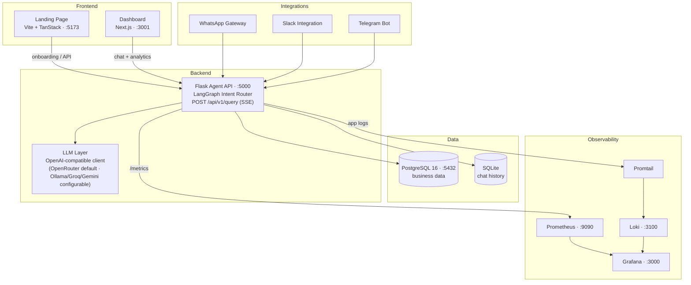
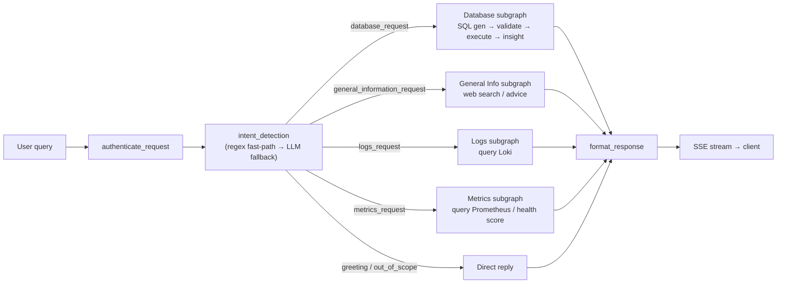

# ProfitPilot — Architecture

This document explains how ProfitPilot's components fit together so new contributors can find
their way around quickly. For setup instructions see the [README](../README.md) and
[CONTRIBUTING](../CONTRIBUTING.md).

ProfitPilot is an AI business-advisory platform: users ask questions in natural language, a Flask
backend routes each query through a **LangGraph intent router** to a specialized subgraph (database
SQL, advice, logs, or metrics), and the answer is streamed back over Server-Sent Events (SSE).

---

## 1. System overview

> Ports reflect `docker-compose.yml`. Grafana and the Next.js dashboard both listen on `3000`
> *inside* their containers; the dashboard is published on host port **3001** to avoid a clash.

---

## 2. Chat / query flow

Every query flows through the same pipeline: authenticate → detect intent → run one or more
subgraphs in execution order → format → stream.

**Intent detection** (`agent_code/nodes/intent_detection.py`) first tries cheap regex fast-paths
(greetings, out-of-scope, logs, metrics, database facts, advisory). If none match, it calls the LLM
with structured output to return an *ordered* list of intents. Compound questions run data intents
(`database`, `logs`, `metrics`) before advice (`general_information`, `hybrid`, `advisory`), capped
at four intents via `order_intents_for_execution()`.

**Database subgraph** (`agent_code/intents/database_request_graph/subgraph.py`) is the deepest path:
`resolve_data_range → validate_entities → fetch_table_schema → SQL_generation → SQL_validation →
execute_query → post_query_operations → business_insight_generator → format_response`. SQL is
validated read-only before execution (see `db_config.py`'s `_assert_read_only_select`).

---

## 3. Layer-by-layer

| Layer | What it does | Where |
|-------|--------------|-------|
| **Frontend** | Landing/onboarding (Vite + TanStack) and the analytics + chat dashboard (Next.js). | `landing-page/`, `dashboard/` |
| **API / orchestration** | Flask app exposing `/api/v1/query` (SSE) and dashboard endpoints; builds and runs the LangGraph router. | `agent_code/app_main.py`, `agent_code/query_execution.py` |
| **Intent router** | Classifies the query and dispatches to subgraphs. | `agent_code/nodes/`, `agent_code/intents/` |
| **LLM** | OpenAI-compatible client (`ChatOpenAI`); OpenRouter by default, swappable to Ollama/Groq/Gemini via env. | `agent_code/llm/base_llm.py` |
| **Data** | PostgreSQL for business data; SQLite for chat history. | `company_db_schema.sql`, `agent_code/seed_db.py`, `db_config.py` |
| **Observability** | App emits `/metrics` (Prometheus) and writes logs shipped by Promtail to Loki; Grafana visualizes both. | `prometheus.yml`, `promtail-config.yaml`, `agent_code/logger/` |
| **Integrations** | WhatsApp, Slack, Telegram gateways that forward to the Flask API. | `whatsapp_gateway/`, `agent_code/slack_integration/` |

---

## 4. Key files for contributors

| File / dir | Purpose |
|------------|---------|
| `docker-compose.yml` | Single source of truth for services, ports, and env wiring. |
| `agent_code/app_main.py` | Main Flask app; SSE endpoints, dashboard APIs. |
| `agent_code/query_execution.py` | Assembles the graph and `stream_agent_sse_lines`. |
| `agent_code/nodes/intent_detection.py` | Intent classification (regex fast-path + LLM). |
| `agent_code/intents/<name>_graph/subgraph.py` | One subgraph per intent (database, general info, logs, metrics). |
| `agent_code/llm/base_llm.py` | LLM client configuration. |
| `agent_code/db_config.py` | DB connection (`DATABASE_URL`) and read-only query helpers. |
| `agent_code/seed_db.py` | Seeds demo business data into PostgreSQL. |
| `company_db_schema.sql` | PostgreSQL schema. |
| `.env.example` | All required environment variables. |
| `*.mmd` (repo root) | Source Mermaid diagrams for the graph flows. |

---

## 5. Docker vs. manual setup

| | Docker Compose (recommended) | Manual |
|---|---|---|
| **Command** | `docker compose up --build` | Run each service yourself |
| **PostgreSQL** | `db` service auto-started | Install/run PostgreSQL 16 locally |
| **Networking** | Services reach each other by name (`db`, `backend`, …) | Use `localhost` + the host ports |
| **`DATABASE_URL` host** | `db` | `localhost` |
| **Observability stack** | Prometheus/Loki/Promtail/Grafana included | Start each manually (often skipped in dev) |
| **Best for** | Full end-to-end runs, matching CI | Iterating on a single service |

For both paths, copy `.env.example` to `.env` and fill in the values first. Seed the database with
`python agent_code/seed_db.py` once PostgreSQL is up.

---

*Diagrams use [Mermaid](https://mermaid.js.org/), which GitHub renders natively. Keep this document
in sync with `docker-compose.yml` and the `*.mmd` sources when the architecture changes.*
